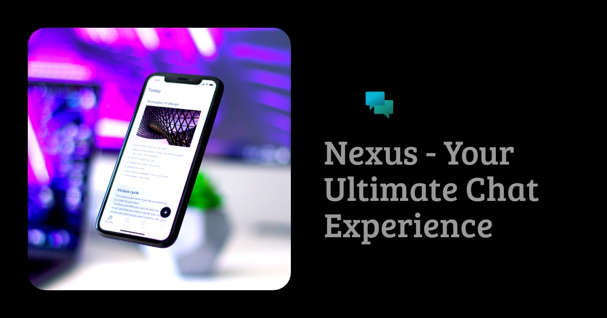

# Nexus Chat Application



Nexus Chat Application is a modern chat application built with the latest technologies, including Next.js, TypeScript, Tailwind CSS, MongoDB, Prisma, and NextAuth. It features real-time chatting, group creation, profile customization, online status tracking, image uploads, and various authentication methods, including email and social logins with Github, Google, and Twitter. This README will provide comprehensive documentation for setting up, running, and customizing the application.

## Demo

View the live demo at [Nexus Chat Application Demo](https://nexus-dk.vercel.app/)

## Features

- **Real-Time Chatting**: Enjoy real-time chat with other users.
- **Group Creation**: Create chat groups for multiple users.
- **Profile Customization**: Update your name and profile picture.
- **Online Status**: See live active/offline status for users.
- **Image Uploads**: Share images in chats using Cloudinary.
- **Multiple Authentication Methods**: Sign in or sign up using email, Github, Google, and Twitter.

## Tech Stack

- **Next.js**: A popular React framework for building web applications.
- **TypeScript**: A statically typed superset of JavaScript.
- **Tailwind CSS**: A utility-first CSS framework for designing modern and responsive UIs.
- **Headless UI**: A set of completely unstyled, fully accessible UI components for React.
- **React**: A JavaScript library for building user interfaces.
- **Prisma**: A modern database toolkit for TypeScript and Node.js.
- **MongoDB**: A NoSQL database for storing chat data.
- **NextAuth**: An authentication library for Next.js applications.
- **Zustand**: A small, fast, and scalable state management library for React.
- **Pusher**: A hosted service that makes it super-easy to add real-time data and functionality to web and mobile applications.
- **Cloudinary**: A cloud service that offers a solution to a web application's entire image management pipeline.

## Installation

Follow these steps to set up the Nexus Chat Application locally:

1. Clone the repository

```bash
git clone https://github.com/yodkwtf/nexus-chat-application.git
cd nexus-chat-application
```

2. Install dependencies

```bash
npm install
```

3. Create a `.env.local` file in the root directory of the project and add the following environment variables:

```bash
DATABASE_URL=<YOUR_MONGODB_CONNECTION_STRING>
NEXTAUTH_SECRET=<YOUR_NEXTAUTH_SECRET>

GITHUB_ID=<YOUR_GITHUB_CLIENT_ID>
GITHUB_SECRET=<YOUR_GITHUB_CLIENT_SECRET>

GOOGLE_ID=<YOUR_GOOGLE_CLIENT_ID>
GOOGLE_SECRET=<YOUR_GOOGLE_CLIENT_SECRET>

TWITTER_ID=<YOUR_TWITTER_CLIENT_ID>
TWITTER_SECRET=<YOUR_TWITTER_CLIENT_SECRET>

NEXT_PUBLIC_CLOUDINARY_CLOUD_NAME=<YOUR_CLOUDINARY_CLOUD_NAME>

NEXT_PUBLIC_PUSHER_APP_KEY=<YOUR_PUSHER_APP_KEY>
PUSHER_APP_ID=<YOUR_PUSHER_APP_ID>
PUSHER_SECRET=<YOUR_PUSHER_SECRET>
```

4. Start the development server

```bash
npm run dev
```

5. Open [http://localhost:3000](http://localhost:3000) with your browser to see the result.

## Contributing

Contributions to this project are welcome. If you'd like to contribute, please follow these steps:

1. Fork this repository.

2. Create a new branch for your feature or bug fix:

```bash
git checkout -b <YOUR_BRANCH_NAME>
```

3. Make the appropriate changes to the files and commit changes:

```bash
git add .
git commit -m "<YOUR_COMMIT_MESSAGE>"
```

4. Push to the branch:

```bash
git push origin <YOUR_BRANCH_NAME>
```

5. View the changes in your fork and create a pull request.

## License

This project is licensed under the MIT License. See the [LICENSE](./LICENSE) file for details.
